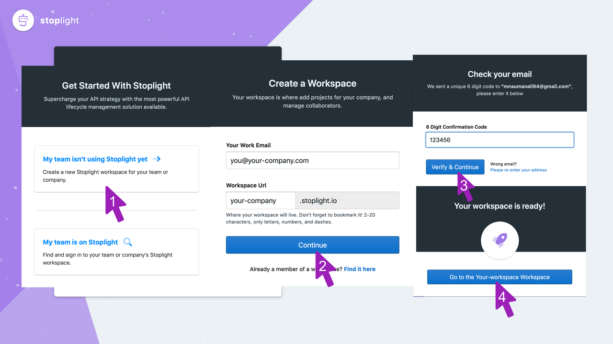
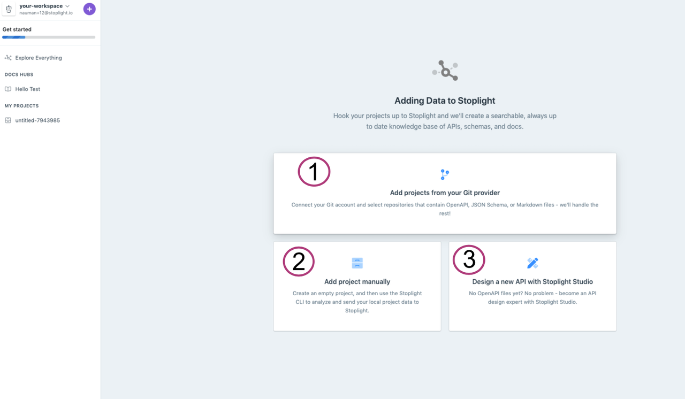
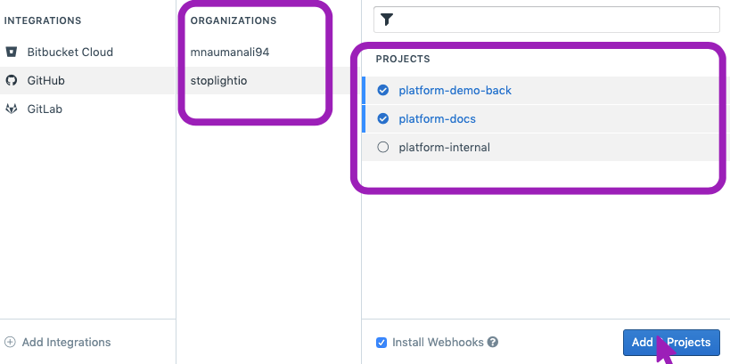
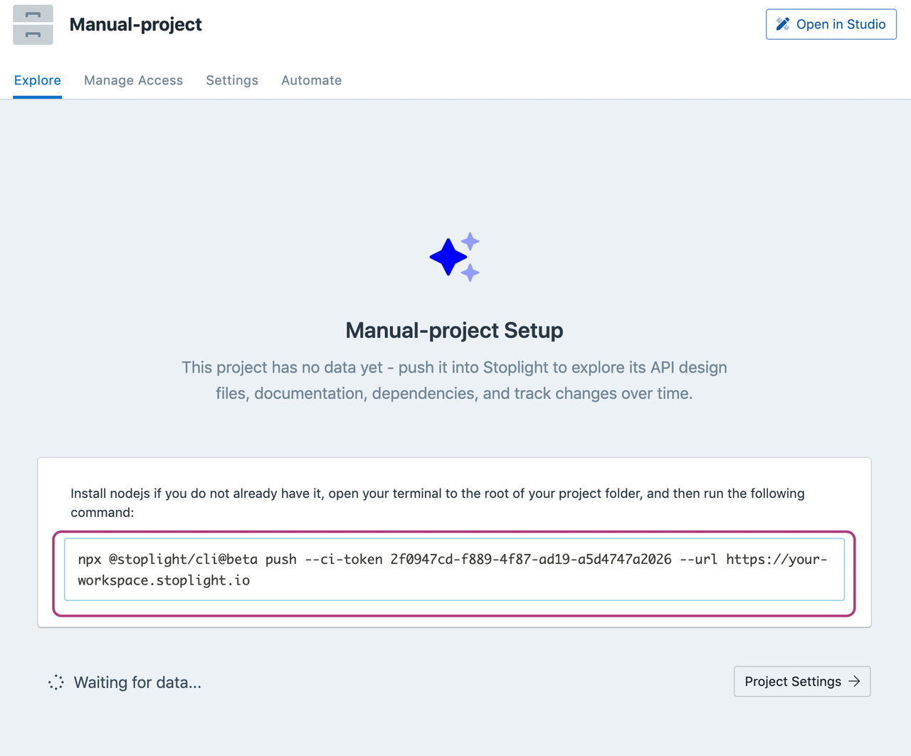

# Setup your Workspace

Workspaces are used to group API projects across your organization to promote visibility, standards, and reuse of artifacts. Setting up a workspace is quick and easy. Get started here:

### Create a Workspace

Workspaces are used to group API projects across your organization to promote visibility, standards, and reuse of artifacts. 

Setting up a workspace is quick and easy. Get started here:

1. Open the [Stoplight Platform Homepage page](https://stoplight.io/welcome). Click on My team isn't using Stoplight yet.

2. Fill in the form by entering your Work email address. Next, input the Workspace name.

3. Input the 6 digit confirmation code you received on your registered email address. Then, click Verify & Continue

4. Congrats, you have created your workspace at Stoplight! Let's create Amazing APIs now. To go to your newly created workspace click Go to your-workspace-name workspace

### Add projects

Within Workspaces, the most important concept in Stoplight is "Projects".  Stoplight looks for projects with API Description Documents, Markdown articles and Images. 

Adding projects is just a few clicks, I promise ;) Let's get started. 

1. [Add projects from your VCS]() Connect your Git provider (GitHub, GitLab, or BitBucket) and start adding projects to your workspace. 

2. [Add a project manually]() If you cannot connect your Git provider, use the Stoplight CLI in your CI to connect your existing projects. These projects cannot b edited in Studio but will be available in explorer.

### Add projects from your Git Provider

You can bring all kinds of projects into explorer to start building a central technical knowledge base for your organization. 

1. **Choose the Git provider** of your choice. 
2. Click on Connect to Git Provider. Follow the instructions on the pop-up screen/ new tab to authenticate.

Upon successful authentication, you should see your organizations listed. **Let's choose projects now**!

**Choose the organization** you want to import the projects from. Select the projects you want to import. 

Click **Add Projects**
 
> Install Webhooks keeps your projects in sync whenever new commits are pushed. There's no need to publish anymore. It's recommended!

### Add a project manually

1. Give this project a name, and click Add Project. This is going to create an empty project where you can then push data. 

2. Copy the command on the screen. Next, navigate to the root folder of the project and run this command. This should push data to this project, and you can view it in explorer. 

> You can add this command to your CI to update the contents whenever something changes. You won't be able to edit this project in Stoplight.

