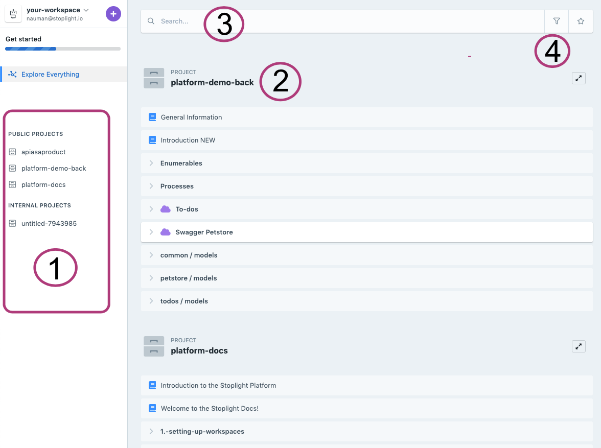
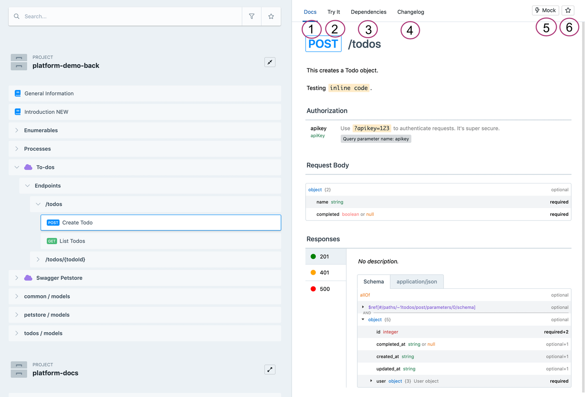

# Getting started with Explorer

Explorer is a central repository for all design assets across your organization that would serve as a source of truth for stakeholders in different parts of the API lifecycle. Stoplight Explorer makes it easy for you to find, search, and manage your API artifacts.

## Understanding the Explorer UI

Explorer has been redesigned to make finding, tracking, and managing design artifacts easily. 

1. The left nav provides you with a grouped view of your Public, Internal and Private projects. You can either choose to explore a single project or explore everything. 

2. You can view assets from each project. You'd be able to see APIs, endpoints, models, and articles. Click on any one of these to open the documentation view.

3. You can search for assets using the search bar. Depending on the context it will search across all your projects or the project you're currently in. 

4. You can filter assets to just see Endpoints, Models, APIs, or Articles. This can be used to find a particular kind of asset easily. You can also just view starred assets using the star button. 

Let’s dive deeper into an asset now. 

## Explore an asset

Choose an asset, and you'll see the documentation view on the right. Here we are looking at an endpoint.

1. **Documentation**: Documentation for all assets is available right in the explorer. Your teams can discover assets and read their documentation. This documentation is generated using the OpenAPI description or markdown in the case of articles.
2. **Try it** (Available for endpoints only) : Try the endpoint out, copy generated code samples, and enable mocking using the Try it tab. 
3. **Dependencies** : Visualize inbound and outbound dependencies, helping you keep dependent assets up to date and avoid breaking changes.
4. **Changelog** : Stakeholders can track changes to ensure up to date implementations, accurate documentation, and plan versions. 
5. **Hosted mocking** : Get a URL to an up to date hosted mock enabling early feedback and parallel development. You can configure static and dynamic responses depending on your needs. 
6. **Star an asset** : Star important assets to promote easy discovery and reuse.

Let’s change the visibility of the project now! 
