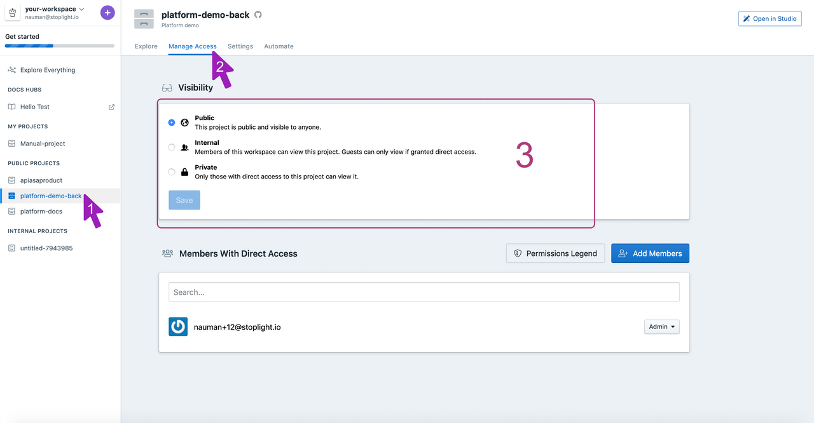

# Toggle project visibility

1. **Choose a project** from the left navigation. 

2. **Go to Manage Access** section of the project. 

3. Project visibility can be tweaked to allow multiple types of users to access. You can set three types of visibility:

**Public**: Everybody including people who aren't a part of your workspace can access the project. You can use this to expose a project for public consumption using the explorer. 

**Internal**: All members of the workspace except guests can view the project. Guests can be granted access directly from the Add members section.

**Private**: Private projects can only be viewed by members who have direct access. You can see the list of members in the Members with Direct Access section. You can also, Add members from your workspace.

You're all set. Let's [invite team members](5.team.md) into the workspace now. 
