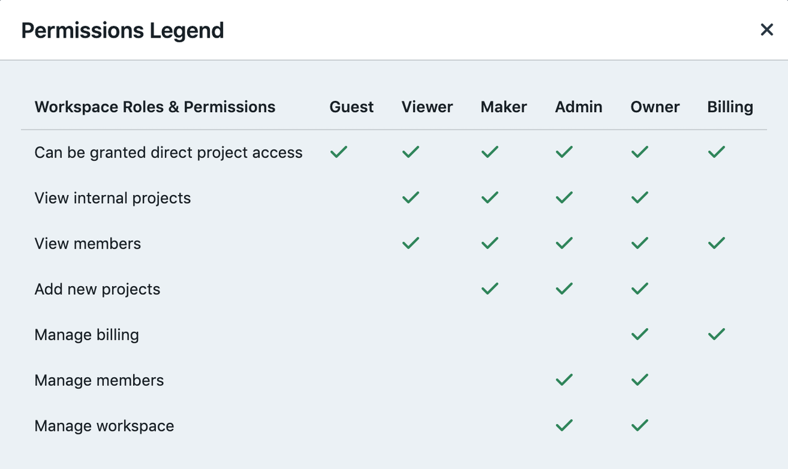
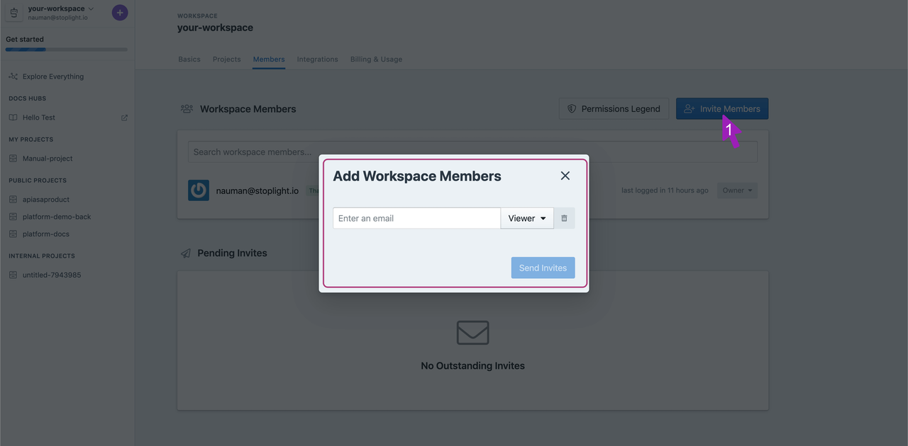
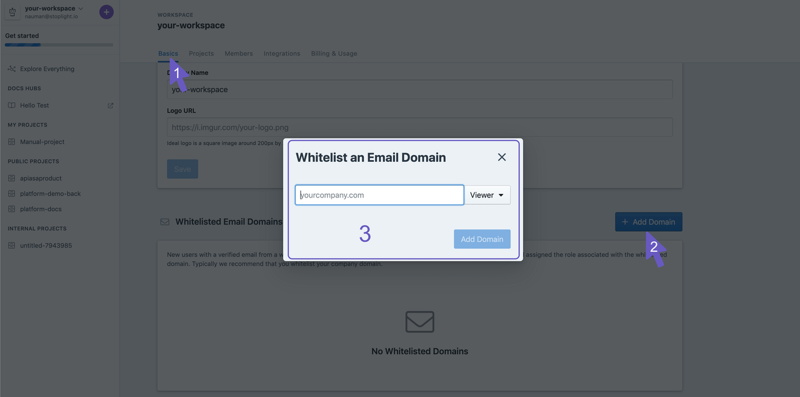

# Onboarding your team

### Roles

You can assign different roles to manage permissions depending on their expected role in the workspace.

**Owner**:  The super Admin with permission to perform all actions in the workspace. Usually, these people are the ones managing the workspace and leading the API effort across the organization.

**Admin**: This role similar permissions but cannot manage the billing section i.e. upgrade plans. Team leaders and product managers could be granted the admin role to allow them to add new members. 

**Maker**: They are able to create and view projects. Your API designers, developers, and tech writers would usually be given the Maker role. They cannot manage members though.

**Viewer**: They can view all internal and public projects. They are usually consumers of the APIs and other stakeholders within your organization.

**Guest**: This is created for folks who need to be given access to a particular project. This could be a customer or consultant aiming to give feedback on a project.

**Billing**: This particular role is reserved for operations of the workspace. This role can update and manage plans and usually is allocated to somebody running operations in a company. 

Ready? Let's invite some team members!

### Invite Members

1. Click on Invite Members in the member's section of the workspace. 

2. To add a member, enter the work email address of the person you want to add and select a role.

Add all the members you're looking to invite with their corresponding roles and click Send Invite. This should send an invitation email to them. They'll be able to sign up using that. 

### Whitelist your domain

As teams become bigger, this can become a cumbersome process. You can whitelist your domains to allow team members to sign up without explicitly inviting them. 

Do remember to share the workspace URL over your company email, Slack, or some other messaging service. Let everybody know your APIs have a friend now! 

1. Navigate to the Settings of your workspace. 

2. Click on Add Domain

3. Enter the domain you want to whitelist. e.g. yourcompany.com and select the default role for members who sign up. You can change their roles later. The recommended role would be a viewer or maker. 
