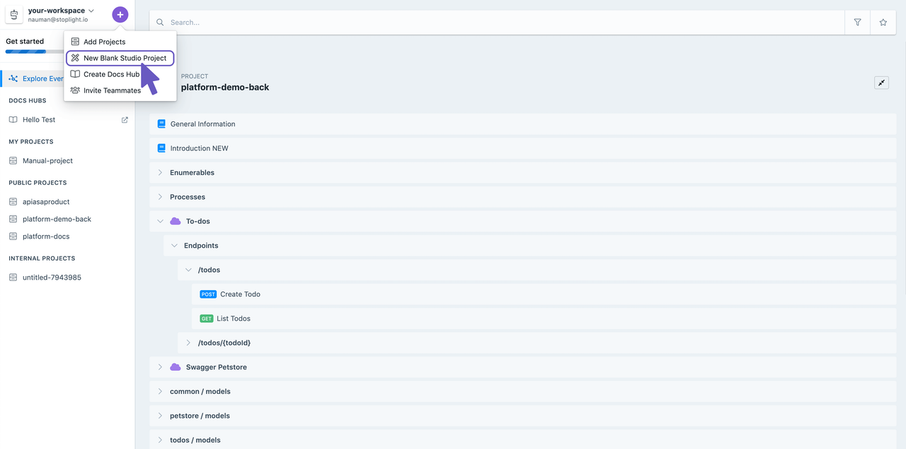

# Create a git project using Studio

### Create a Blank Project
Lets get started by creating a blank project.

Hopefully you can spin up a design quickly. We'll have a conversation around design some other day. For now let's push this project to Git.

### Push to Git from Studio
Now you can easily push locally created projects in Studio to Git. This allows you to design locally and then make them part of the explorer once you're satisfied. 

1. Click on the promote icon as shown in the image.

2. Click on Promote to Git Repo and authenticate with your Git account. If your account isn't already connected, you can connect it in the settings. 

To-do : Debug error wit git